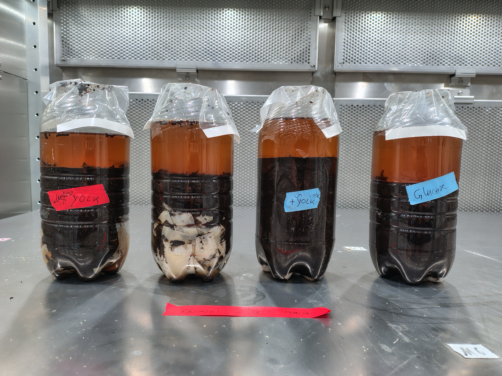
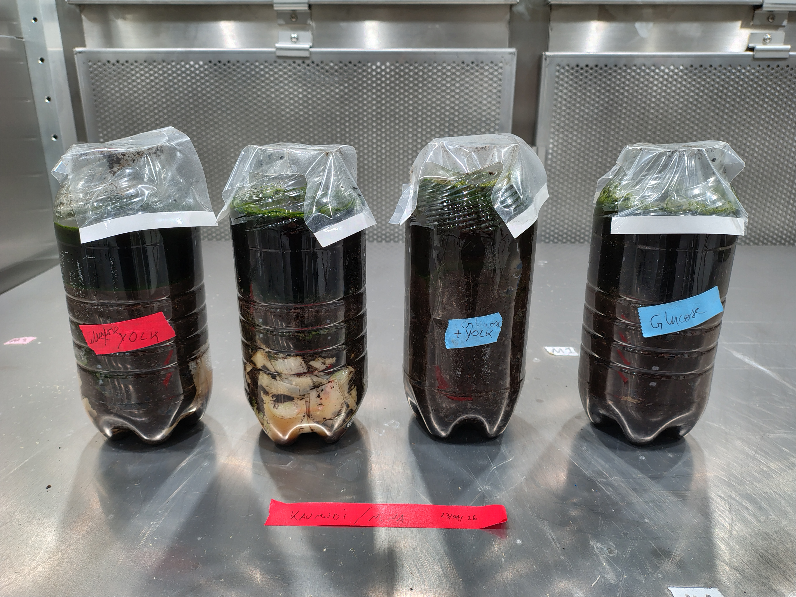
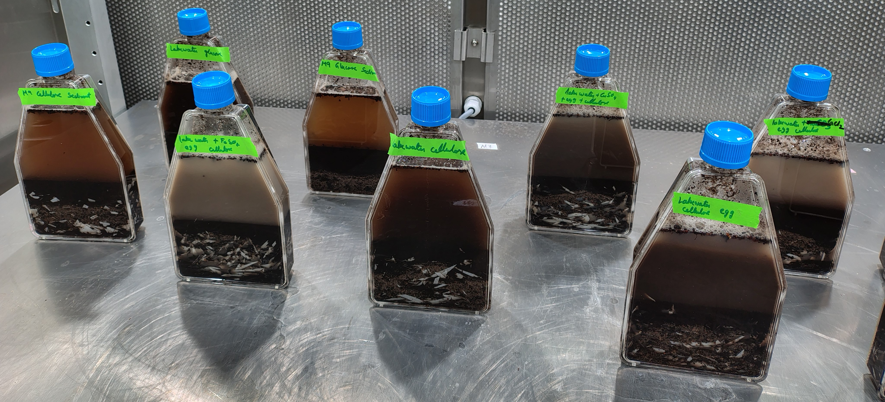
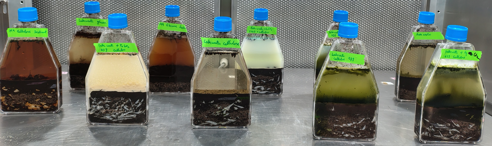
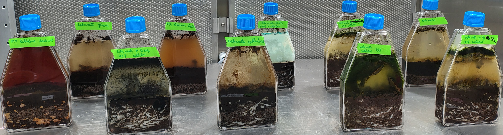
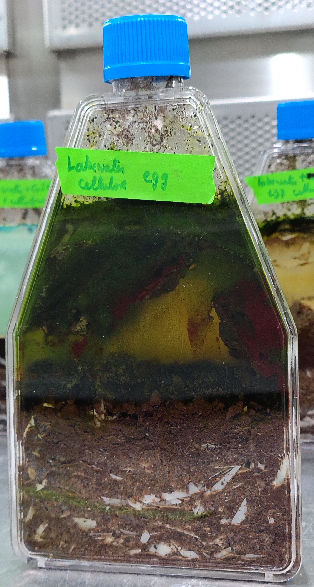
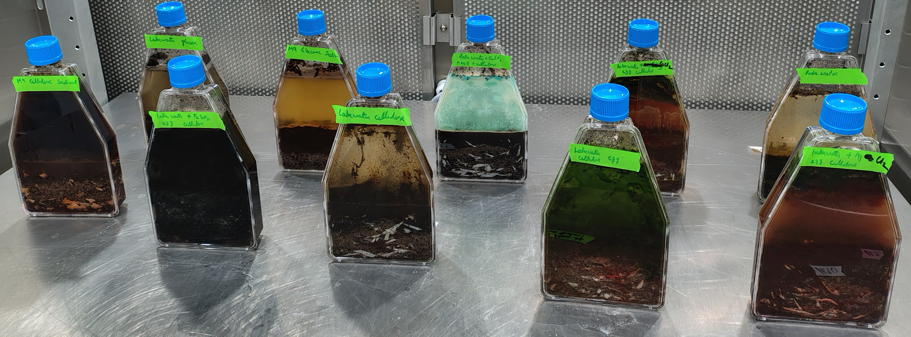
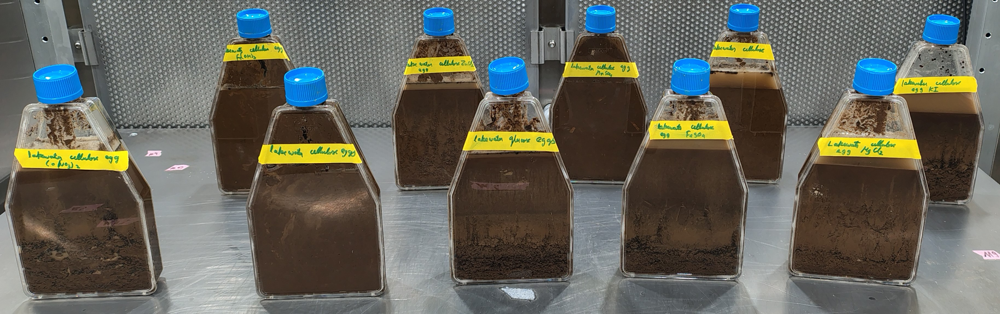
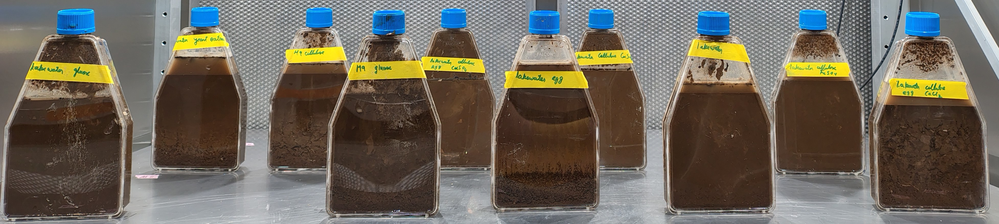

For my institute’s Open Science Day in September, I decided to set up a few Winogradsky columns to showcase the amazing diversity of microbes in nature. 

**What are Winogradsky columns?**  
They are transparent glass or (preferably) plastic columns or tubes containing soil and water from lakes or ponds. Originally developed by Sergei Winogradsky in the late 1800s to mimic natural ponds and lakes in the lab, they enable the careful study of natural microbial communities. Essentially, these are plastic cylinders filled about halfway with soil from lakebeds and topped with lake water. After a few weeks of incubation, layers develop, created by metabolic niches, often with different colors, reflecting different microbes that live in those layers. The top layer is usually green and photosynthetic, generating oxygen and organic carbon compounds for the layer below. The second layer is usually made of aerobic microbes that use up most of the oxygen and organic carbon. This layer could be made of any color, depending on which microbes grow in the soil. The layers further below are low on oxygen and use other chemicals such as iron and sulphur instead. These microbes are typically orange-red, purple and green.The lowest layers are completely devoid of oxygen and support anaerobic microbes. 

**Motivation**
One motivation for doing this was that we’d recently published a paper revealing how diverse but distinct communities assemble from the same initial compost sample depending on whether the carbon source was cellulose (paper) or glucose. I wanted to see if we could visualize these differences in a Winogradsky column. The other motivation was to simply have fun!

**First attempt**
As I had never set up these columns before, I started four pilot columns about 5 months before our open day. For the columns, we gathered old plastic water bottles (1 L), and sawed off their necks. We dug up soil next to the lake behind our institute and divided it in half. One half was thoroughly mixed with yolk from 2 eggs (sources of sulphur), while the other got nothing extra. The four bottles were labelled glucose, glucose+egg yolk, cellulose, and cellulose+egg yolk. To one bottle with egg yolk and one without, we added 20 g of glucose. To the other two bottles, we added 20 g of cellulose (paper pieces). Cutting up 20g of paper into smaller pieces was surprisingly annoying! We filled the bottles about three-fourths with the soil so that two bottles had soil with egg yolk and two had soil without egg yolk. Instead of lake water, we added M9 minimal medium to mimic our experiment and covered the mouths with breathe-easy membranes commonly available in labs. The bottles were incubated in plant chambers which provided day and night cycles. After a couple of weeks, the green layer on the top was clearly visible. However, the soil was too dark to observe any other colors, even after waiting longer. Another issue was that the ridges on the sides of the bottle and curvature made it slightly more difficult to see colors. 

<figure>
  
  <figcaption>First attempt - Day 0</figcaption>
</figure>

<figure>
  
  <figcaption>First attempt - Day 11</figcaption>
</figure>

**Second attempt**
For our second try, we purchased tissue culture bottles - narrow and tall, with 2 flat surfaces. We collected soil again from next to the lakes. This time we started 10 bottles, some with egg yolk, some without, some with lake water and some with M9, some with glucose, some with cellulose, and some had extra salts like copper sulphate, ferrous sulphate etc. These salts add an extra dimension for the microbes to navigate when self-organizing themselves into layers. We filled the bottles 1/4th with soil and 1/4th with liquid (either lake water or M9), kept the lids loose and incubated the bottles in the same chamber as before. Within a few weeks, beautiful colors emerged - blues, purples, reds and greens. And the colors changed with time, changing in intensity or giving way to other colors. The most dramatic was the column with copper sulphate. After two weeks, the liquid above the soil changed to a vibrant blue before fading out. Most columns had patches of purple and the column with ferrous sulphate turned reddish brown and then completely black - a lustrous black. The liquid in the column with cellulose was more red while the column with glucose was a dirty brown. Cytophaga - bacteria that degrade cellulose form red colonies. Cool!

<figure>
  
  <figcaption>Second attempt - Day 0</figcaption>
</figure>

<figure>
  
  <figcaption>Second attempt - Day 7</figcaption>
</figure>

<figure>
  
  <figcaption>Second attempt - Day 15</figcaption>
</figure>

<figure>
  
  <figcaption>Second attempt - Day 19: Cellulose and egg. Can see patches of purple.</figcaption>
</figure>

<figure>
  
  <figcaption>Second attempt - Day 19: With added caclium chloride. Spatial structures formed.</figcaption>
</figure>

<figure>
  
  <figcaption>Second attempt - Day 19: With added copper sulphate. Blue color developed over time (note it wasn't there initially).</figcaption>
</figure>

<figure>
  
  <figcaption>Second attempt - Day 19: Cellulose in M9; turned a deep red. </figcaption>
</figure>

<figure>
  
  <figcaption>Second attempt - Day 19: Glucose in M9; turned a dirty brown. </figcaption>
</figure>

<figure>
  
  <figcaption>Second attempt - Day 19: Cellulose in lake water; patches of colors and structure.</figcaption>
</figure>

<figure>
  
  <figcaption>Second attempt - Day 19: Glucose in lake water more uniform and less colorful than with cellulose.</figcaption>
</figure>

<figure>
  
  <figcaption>Second attempt - Day 19: Just lake water, with no additives. </figcaption>
</figure>

<figure>
  
  <figcaption>Second attempt - Day 31 </figcaption>
</figure>

**Third attempt**
I did a bit of digging and found a paper that suggested adding diatomaceous earth to the columns to make the soil lighter and the colors easier to see. So we purchased this diatomaceous earth - essentially powdered fossils of diatoms - online (fun fact - it was discovered in Lüneberger Heide, not too far from our institute and a wonderful place to hike!) I also read that anaerobic conditions could be more conducive to layer formation. So, for the third and final try, we started the columns in 20 tissue culture flasks, this time with soil from the lakeside mixed with diatomaceous earth; some with different salts, some had egg yolk, different carbon sources (glucose, or cellulose or yeast extract or nothing), and either lake water or M9. Unlike in the previous two tries, this time I closed the lids tightly. Two weeks later - disaster! So much gas was produced in a couple of the columns that they… umm… vomited some stuff out. Luckily, because of the way the flasks were built, they didn’t explode - rather they split at the seams under pressure. The entire chamber stunk of poop! I cleaned up the cabinet and quickly loosened all the caps. In hindsight, I think I had filled up the flasks too much. Regardless, in the following weeks we did observe colors in several columns, although I could not tell if the diatomaceous earth had made a difference. Apart from the columns with only cellulose, the columns with potassium iodide and magnesium chloride had striking colors. The column with zinc chloride was interesting - a brown layer was on the top followed by a bulky green layer. The columns with different iron salts were all lustrous black as before.
<figure>
  
  <figcaption>Third attempt - Day 0 - part 1 </figcaption>
</figure>

<figure>
  
  <figcaption>Third attempt - Day 0 - part 1 </figcaption>
</figure>
**The open day**
We had a poster with all the relevant information in German including a repurposed figure from HHMI’s teaching platform (after obtaining their permission) to explain the layers. Additionally, I had printed out a few pictures of the second try as the colors changed with time. We had a brief write-up about Winogradsky. Finally, we made a few 3D printed models of glucose and cellulose structures to show how glucose (here we displayed a commonly available glucose packet) and cellulose (here we simply displayed paper) are related. With a ruler to show how small a millimeter is (to say that microbes are 1000 times smaller) and plastic bottles with their necks sawed off, we were ready to tell the visitors about these columns. 

The visitors were quite amazed at how a simple experiment can demonstrate so much. Kids and adults alike loved the colors and learning about microbial communities. People took pictures of our columns and the poster. The most common question was what we learn from it. A lot of course, as we were happy to explain - (1) how microbial communities assemble, the rules and (2) we can enrich for microbes that are capable of consuming specific chemicals, a fact that can be leveraged for bioremediation. 

It was a long day, but it was good to interact with the public and explain how cool microbial communities are. I’m particularly proud that I managed to convey all this in German! 

*Notes for the future*

The colors seemed to peak after a month. So it is best to start about a month before the day of the exhibition. 

Filling the bottles to half their volume is likely ideal. The flat tissue culture flasks were great for viewing. Shining torch light on the flasks made the colors more vibrant.

Diatomaceous earth did not seem to make a huge difference.

Copper salts, iron salts, potassium iodide, zinc chloride, and magnesium chloride produced interesting colors. 

Given how dirty the chamber got, it would be better to place the columns on something disposable.

It may be worth not mixing the egg yolk homogeneously with the soil. Instead, adding it in a middle layer could produce more distinct layers. 
